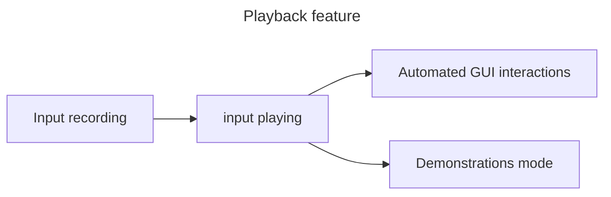

[← back to table of contents](README.md)

# Nodezator features

## Playback feature

Automated GUI interactions is actually performed with a feature called input playing. The input playing feature is part of a bigger chain of features that together form the playback feature, as represented in the diagram below:

The input recording feature allows input data for a Nodezator usage session (mouse and keyboard interactions) to be recorded. The input playing feature is responsible for playing such recorded input data. The ability to play input can then be used to support automated GUI interactions and the demonstrations mode features.

And automated GUI interactions helps support system testing, although system testing itself is not part of the playback feature (which is why it doesn't appear in the diagram).

The demonstrations mode is meant to work as a kind of tutorial player. As the name implies, it will feature several demonstrations for the users to watch. Such demonstrations should support audio and custom graphics/text on the screen, to highlight/explain specific actions/areas/objects. Although desirable and convenient, it is not strictly necessary (many other apps don't have such feature) which is why it should take some time until it is implemented.

The input recording and playing features and the demonstrations mode are also supposed to be available to regular users at some point in the future. They could be used to create custom demonstrations and other materials for the purposes of teaching/training. The reason such features are not available yet is that they'd require a review of the data model employed by Nodezator. At the present moment (Nodezator 1.4.6), we use a text-based file to store graph information, but to make such features available to users we'd probably need to store other kinds of data, and thus would need to use .zip files in some way (either by replacing our text-based solution completely or accepting .zip files in addition to it).

For now, input playing and recording are meant to be used only by developers/contributors, for the sake of providing automated GUI interactions used in system testing.
